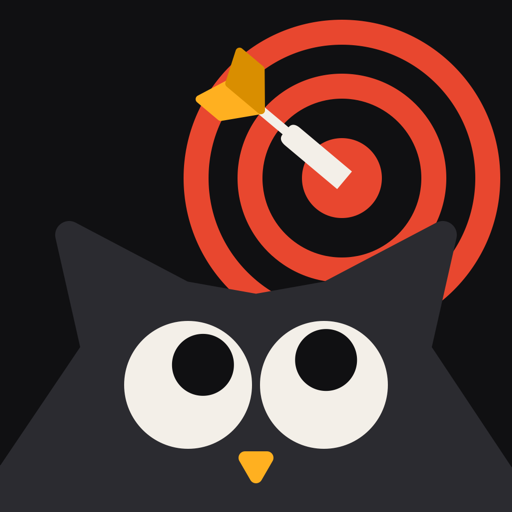

  

<h1 align="center">Pomoji</h1>

<strong>Focus towards your goal.</strong> 
A Pomodoro timer for iPhone with Pomo, a tiny owl coach.

  <a href="https://armagangok.github.io/pomoji-app/"><strong>🌐 Visit the website</strong></a>
  &nbsp;·&nbsp;
  <a href="https://apps.apple.com/app/id6754637383"><strong> Download on the App Store</strong></a>

---

This repository hosts the Pomoji website on GitHub Pages:
**https://armagangok.github.io/pomoji-app/**

## Pages

| Page | Link |
|---|---|
| Home | https://armagangok.github.io/pomoji-app/ |
| The Pomodoro Technique, explained | https://armagangok.github.io/pomoji-app/pomodoro-technique.html |
| What to look for in a Pomodoro timer for iPhone | https://armagangok.github.io/pomoji-app/pomodoro-timer-app-iphone.html |
| How to focus when studying | https://armagangok.github.io/pomoji-app/study-focus-tips.html |
| Support | https://armagangok.github.io/pomoji-app/support.html |
| Privacy Policy | https://armagangok.github.io/pomoji-app/privacy.html |
| Terms of Use | https://armagangok.github.io/pomoji-app/terms.html |

## About Pomoji

- Pomodoro focus sessions with short and long breaks
- Alarms that ring through Silent mode when a session ends
- Live countdown on the Lock Screen and in the Dynamic Island
- A daily session goal, streaks and focus stats
- Pomo companions for focus, short breaks and long breaks
- No account, no ads, no tracking

## Support

Questions or feedback: [appsweatmobile@gmail.com](mailto:appsweatmobile@gmail.com)

© AppSweat. All rights reserved.
